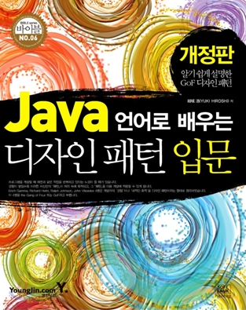

# OOP Design Pattern With Java

> SSAFY 교육을 통해 Java와 객체지향 프로그래밍을 다시 한번 새롭게 배우며 실제 적용가능 한 디자인 패턴에 대해 궁금해져 시작하게 된 디자인패턴 학습

디자인 패턴에 대해서 많이 들어봤지만 정작 제대로 된 디자인 패턴 학습을 해본적이 없는 것 같습니다.

따라서 이번기회를 통해 Yuki Hirosh 저 Java 언어로 배우는 디자인 패턴 입문 책을 통해 디자인패턴에 대해 학습하고 디자인 패턴을 적용한 저만의 프로젝트를 진행해 볼 예정입니다.

**참고도서** -  Java 언어로 배우는 디자인 패턴 입문

